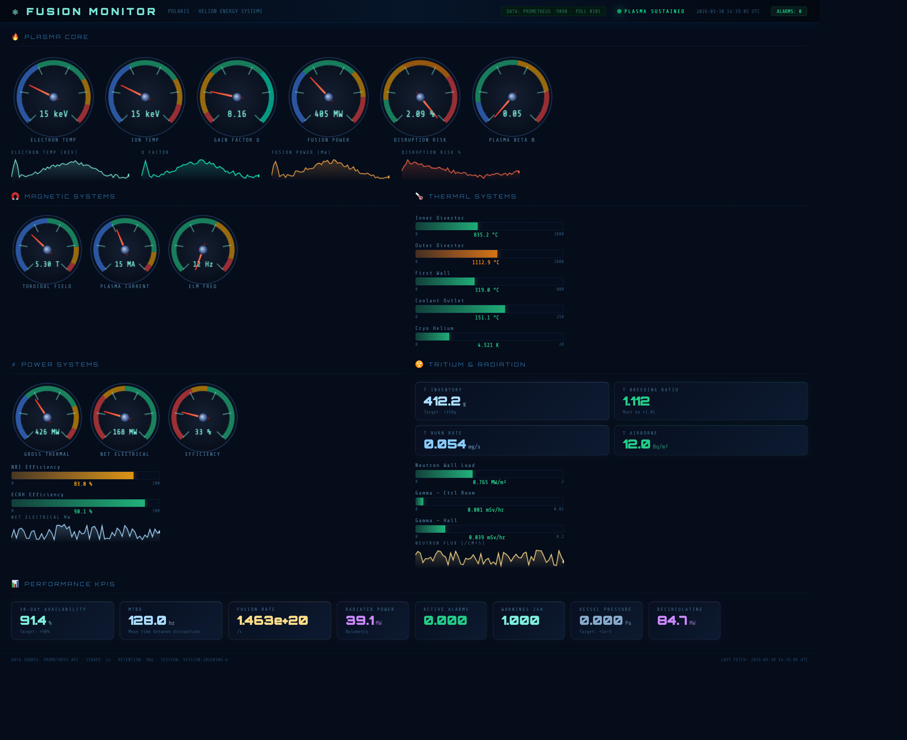
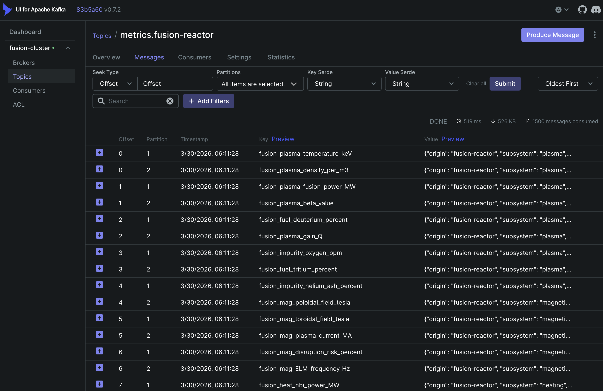
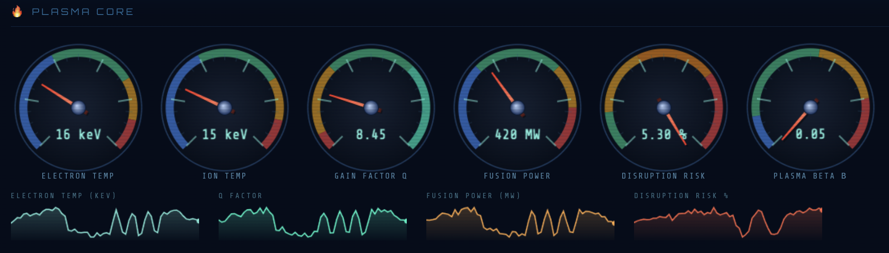

# ⚛️ Fusion Monitor — Polaris Live Telemetry Stack

## 🌐 Live Demo URLs

The stack is accessible at these public URLs:

| Service | URL | Credentials |
|---|---|---|
| ⚛️ **React Dashboard** | `https://fusion-monitor.southofsleep.com` | — |
| 📊 **Grafana** | `https://grafana.fusion-monitor.southofsleep.com` | `admin` / set in bootstrap |
| 📡 **Prometheus** | `https://prometheus.fusion-monitor.southofsleep.com` | — |
| 🔥 **Kafka UI** | `https://kafka.fusion-monitor.southofsleep.com` | — |


[](https://docs.docker.com/compose/)
[](https://kafka.apache.org/)
[](https://prometheus.io/)
[](https://grafana.com/)
[](https://react.dev/)
[](https://www.timescale.com/)
[](https://python.org/)

A **full-stack real-time monitoring platform** for a fusion reactor prototype, built on a production-grade observability pipeline. Simulates 57 live sensor metrics across plasma, magnetic, thermal, tritium, radiation, and power systems — flowing through Kafka, stored in three data tiers, and visualised in a custom React dashboard with analog needle gauges.

> Designed to be extended to monitor **Kubernetes clusters**, **HPC GPU nodes**, and **industrial systemd hosts** by adding new Kafka producers. The consumer, storage, and visualisation layers require zero changes.

## 📸 Screenshots

### React Dashboard — Live Analog Gauges


### Plasma Core — Analog Gauge Detail  


### Kafka UI — Live Message Stream


### Prometheus — Scrape Targets


---

## 📸 Dashboard


> *React frontend at `http://localhost:8080` — live analog gauges pulling data from the Prometheus API every 5 seconds. Includes plasma core, magnetic systems, thermal bars, tritium/radiation stats, power output, and KPI strip.*

---

## 📋 Table of Contents

- [Architecture Overview](#architecture-overview)
- [Container Map](#container-map)
- [Data Flow](#data-flow)
- [JSON Metric Structure](#json-metric-structure)
- [What the Structure Covers](#what-the-structure-covers)
- [Three-Tier Storage](#three-tier-storage)
- [File Layout](#file-layout)
- [Deployment Instructions](#deployment-instructions)
- [Service URLs](#service-urls)
- [Querying Each Data Tier](#querying-each-data-tier)
- [Extending to New Data Sources](#extending-to-new-data-sources)
- [Troubleshooting](#troubleshooting)

---

## Architecture Overview

```
╔══════════════════════════════════════════════════════════════════════╗
║                         DATA SOURCES                                 ║
║                                                                      ║
║  [fusion-producer]   [k8s-producer*]   [hpc-producer*]              ║
║  origin:             origin:            origin:                      ║
║  fusion-reactor      kubernetes         h200-cluster                 ║
╚══════════╦═══════════════════════╦══════════════════════════════════╝
           ↓                       ↓
╔══════════════════════════════════════════════════════════════════════╗
║                      APACHE KAFKA  :9092                             ║
║                                                                      ║
║  topic: metrics.fusion-reactor                                       ║
║  topic: metrics.kubernetes          (* future producers)             ║
║  topic: metrics.h200-cluster                                         ║
║  topic: metrics.systemd                                              ║
╚══════════╦══════════════════════════════════════════════════════════╝
           ↓
    ┌───────┴────────┐
    ↓                ↓
╔═══════════════╗  ╔═══════════════════════════╗
║  prometheus-  ║  ║   timescale-writer         ║
║  bridge       ║  ║   Batch inserts →          ║
║  → Pushgateway║  ║   tsdb.metrics hypertable  ║
╚══════╦════════╝  ╚══════════════╦════════════╝
       ↓                          ↓
╔══════════════╗         ╔════════════════════╗
║  Prometheus  ║         ║   TimescaleDB      ║
║  :9090       ║         ║   :5432            ║
║  15d TSDB    ║         ║   1yr compressed   ║
╚══════╦═══════╝         ╚════════╦═══════════╝
       ↓                          ↓
╔══════════════════════════════════════════════╗
║         PRESENTATION LAYER                    ║
║                                               ║
║  React UI :8080   Grafana :3000   pgAdmin :5050║
╚══════════════════════════════════════════════╝
```

---

## Container Map

| Container | Image | Role | Port |
|---|---|---|---|
| `zookeeper` | `confluentinc/cp-zookeeper:7.6.0` | Kafka cluster coordinator | internal |
| `kafka` | `confluentinc/cp-kafka:7.6.0` | Message broker — all metrics flow here | `9092` (internal) `29092` (host) |
| `kafka-ui` | `provectuslabs/kafka-ui` | Browse topics, messages, consumer lag | `8090` |
| `pushgateway` | `prom/pushgateway:v1.8.0` | Prometheus inbox — bridge posts here | `9091` |
| `fusion-producer` | custom Python 3.12 | Simulates 57 reactor metrics → Kafka | — |
| `prometheus-bridge` | custom Python 3.12 | Kafka consumer → Pushgateway flush every 5s | — |
| `timescale-writer` | custom Python 3.12 | Kafka consumer → TimescaleDB bulk insert | — |
| `prometheus` | `prom/prometheus:v2.51.0` | Scrapes Pushgateway, 15-day TSDB | `9090` |
| `timescaledb` | `timescale/timescaledb:latest-pg16` | Long-term compressed time-series + metadata | `5432` |
| `pgadmin` | `dpage/pgadmin4` | Web SQL client for TimescaleDB | `5050` |
| `grafana` | `grafana/grafana:10.4.0` | Ops dashboards fed by Prometheus | `3000` |
| `fusion-ui` | custom React + nginx | Custom analog gauge dashboard | `8080` |

---

## Data Flow

```
fusion-producer (Python)
  └─ every 5s publishes 57 JSON envelopes
       └─→ Kafka topic: metrics.fusion-reactor
               │
               ├─→ prometheus-bridge (Consumer Group A)
               │       └─ keeps latest value per metric in memory
               │       └─ flushes to Pushgateway every 5s
               │               └─→ Prometheus scrapes Pushgateway
               │                       └─→ Grafana + React UI query Prometheus
               │
               └─→ timescale-writer (Consumer Group B)
                       └─ batches 200 rows or 5s
                       └─ bulk INSERT into tsdb.metrics hypertable
                               └─→ pgAdmin + direct SQL queries
```

Kafka's **consumer group** model means both consumers receive every message independently — the bridge and the writer each get the full stream without interfering with each other.

---

## JSON Metric Structure

Every message published to Kafka uses this envelope format:

```json
{
  "origin":    "fusion-reactor",
  "subsystem": "plasma",
  "metric":    "fusion_plasma_temperature_keV",
  "value":     15.4,
  "unit":      "keV",
  "timestamp": "2026-03-09T05:00:00Z",
  "tags": {
    "reactor_id":   "FRP-001",
    "facility":     "Helion Engergy",
    "reactor_type": "Polaris",
    "location":     "Building-1"
  }
}
```

### Full Sensor JSON Schema

The complete reactor state is represented as a nested JSON document:

```json
{
  "fusion_reactor": {
    "metadata": {
      "reactor_id": "FRP-001",
      "facility_name": "Helion Energy",
      "reactor_type": "Polaris",
      "operational_status": "active",
      "last_updated": "2026-03-06T14:32:00Z",
      "uptime_seconds": 345600,
      "session_id": "SESSION-20260306-A"
    },
    "plasma": {
      "temperature_keV": 15.4,
      "temperature_kelvin": 178700000000,
      "density_per_m3": 1.2e20,
      "pressure_pascals": 3.1e5,
      "confinement_time_seconds": 3.8,
      "beta_value": 0.047,
      "q_factor": 1.82,
      "fusion_power_MW": 420.5,
      "heating_power_MW": 50.0,
      "gain_factor_Q": 8.41,
      "fuel_mix": { "deuterium_percent": 50.0, "tritium_percent": 50.0 },
      "impurity_levels": {
        "carbon_ppm": 0.4, "oxygen_ppm": 0.2,
        "tungsten_ppm": 0.01, "helium_ash_percent": 2.1
      }
    },
    "magnetic_field": {
      "toroidal_field_tesla": 5.3,
      "poloidal_field_tesla": 0.8,
      "plasma_current_MA": 15.0,
      "disruption_risk_percent": 3.2,
      "ELM_frequency_Hz": 12.5,
      "ELM_type": "Type-I"
    },
    "heating_systems": {
      "neutral_beam_injection": {
        "power_MW": 20.0, "beam_energy_keV": 100, "efficiency_percent": 82.3
      },
      "electron_cyclotron_resonance_heating": {
        "power_MW": 20.0, "frequency_GHz": 170, "efficiency_percent": 90.1
      }
    },
    "vacuum_systems": {
      "vessel_pressure_pascal": 1.5e-6,
      "leak_rate_Pa_m3_per_s": 2.1e-9
    },
    "first_wall_and_divertor": {
      "heat_flux_MW_per_m2": {
        "inner_target": 8.4, "outer_target": 11.2, "first_wall_peak": 1.8
      },
      "tile_surface_temperature_C": {
        "inner_divertor_avg": 842, "outer_divertor_avg": 1104, "first_wall_avg": 320
      }
    },
    "cooling_systems": {
      "primary_coolant": {
        "inlet_temperature_C": 70, "outlet_temperature_C": 150,
        "flow_rate_kg_per_s": 1200, "pressure_MPa": 1.5
      },
      "cryogenic_system": { "helium_coolant_temperature_K": 4.5 }
    },
    "tritium_systems": {
      "tritium_inventory_grams": 410.5,
      "tritium_burn_rate_mg_per_s": 0.056,
      "tritium_breeding_ratio": 1.12,
      "tritium_airborne_Bq_per_m3": 12.5
    },
    "power_systems": {
      "gross_thermal_power_MW": 420.5,
      "net_electrical_output_MW": 168.2,
      "recirculating_power_MW": 85.0,
      "plant_efficiency_percent": 33.2
    },
    "radiation_monitoring": {
      "neutron_flux_per_cm2_per_s": 3.6e14,
      "neutron_wall_loading_MW_per_m2": 0.78,
      "gamma_dose_rate_mSv_per_hr": {
        "control_room": 0.001, "reactor_hall_perimeter": 0.04
      },
      "tritium_airborne_Bq_per_m3": 12.5
    },
    "diagnostics": {
      "total_radiated_power_MW": 38.6,
      "ion_temperature_keV": 14.9,
      "measured_fusion_rate_per_s": 1.49e20
    },
    "safety_systems": {
      "emergency_shutdown_system": { "status": "armed", "response_time_ms": 120 },
      "plasma_termination_triggers": {
        "disruption_mitigation_system": "armed",
        "shattered_pellet_injectors": 6
      }
    },
    "alarms": {
      "active_alarms": [],
      "total_active": 0,
      "total_warnings_24h": 1,
      "total_critical_24h": 0
    },
    "performance_metrics": {
      "availability_percent_30d": 91.4,
      "mean_time_between_disruptions_hours": 128.4
    }
  }
}
```

---

## What the Structure Covers

| Subsystem | Key Metrics | Count |
|---|---|---|
| **Plasma Core** | Temperature (keV/K), density, pressure, confinement time, beta, Q factor, fusion power, gain, fuel mix, impurities | 16 |
| **Magnetic Systems** | Toroidal/poloidal field, plasma current, disruption risk, ELM frequency | 5 |
| **Heating Systems** | NBI power/efficiency, ECRH power/efficiency | 4 |
| **Vacuum** | Vessel pressure, leak rate | 2 |
| **Divertor / First Wall** | Heat flux (inner/outer/wall), surface temperatures, erosion rate | 7 |
| **Cooling** | Coolant inlet/outlet temps, flow rate, pressure, cryo helium temp | 5 |
| **Tritium** | Inventory, burn rate, breeding ratio, airborne concentration | 4 |
| **Power Systems** | Gross thermal, net electrical, recirculating power, plant efficiency | 4 |
| **Radiation** | Neutron flux, wall loading, gamma dose (control room + hall) | 4 |
| **Diagnostics** | Total radiated power, ion temperature, fusion rate | 3 |
| **Performance / Alarms** | 30-day availability, MTBD, active alarms, 24h warnings | 4 |
| **TOTAL** | | **57 metrics** |

---

## Three-Tier Storage

| Tier | Store | Retention | Best for |
|---|---|---|---|
| 🔴 **Hot** | Prometheus TSDB | 15 days | Live dashboards, alerting, sub-second queries |
| 🟡 **Warm** | TimescaleDB `tsdb.metrics` | 1 year (auto-compressed after 7 days) | Trend analysis, historical reporting, aggregate queries |
| 🟢 **Cold** | PostgreSQL `meta.*` | Permanent | Alert history, thresholds config, audit trail, source registry |

### TimescaleDB Schemas

```
fusiondb
├── tsdb
│   ├── metrics          ← hypertable, 1-day chunks, 15x compression
│   └── latest_metrics   ← view: most recent value per metric
└── meta
    ├── sources          ← registered data origins
    ├── thresholds       ← warn/crit values per metric
    ├── alert_history    ← every fired alert, permanent
    ├── maintenance_windows
    ├── audit_log
    ├── active_alerts    ← view: unresolved alerts
    └── current_breaches ← view: metrics above warn threshold right now
```

---

## File Layout

```
fusion-monitor/
│
├── docker-compose.yml               ← Full 12-container stack definition
├── prometheus.yml                   ← Scrape config (targets Pushgateway)
│
├── producers/
│   └── fusion/
│       ├── fusion_producer.py       ← Simulates 57 metrics → publishes to Kafka
│       ├── Dockerfile               ← python:3.12-slim + librdkafka
│       └── requirements.txt         ← confluent-kafka
│
├── consumers/
│   ├── prometheus-bridge/
│   │   ├── prometheus_bridge.py     ← Kafka → Pushgateway flush every 5s
│   │   ├── Dockerfile
│   │   └── requirements.txt         ← confluent-kafka, requests
│   └── timescale-writer/
│       ├── timescale_writer.py      ← Kafka → TimescaleDB bulk insert
│       ├── Dockerfile
│       └── requirements.txt         ← confluent-kafka, psycopg2-binary
│
├── sql/
│   └── init.sql                     ← Auto-runs on TimescaleDB first boot
│                                       Creates tsdb + meta schemas, hypertable,
│                                       compression/retention policies, views,
│                                       and seeds sources + thresholds tables
│
├── frontend/
│   ├── Dockerfile                   ← 2-stage: Node build → nginx serve
│   ├── nginx.conf                   ← SPA routing + /prometheus/ proxy
│   ├── package.json
│   ├── vite.config.js
│   ├── index.html
│   └── src/
│       ├── main.jsx                 ← React entry point
│       └── FusionDashboard.jsx      ← Full dashboard: analog gauges, bar gauges,
│                                       sparklines, stat cards — all live from
│                                       Prometheus API via fetch()
│
└── grafana/
    ├── provisioning/
    │   ├── datasources/
    │   │   └── prometheus.yml       ← Auto-wires Prometheus datasource
    │   └── dashboards/
    │       └── fusion.yml           ← Auto-loads dashboard JSON on boot
    └── dashboards/
        └── fusion_reactor.json      ← 30+ panel Grafana dashboard definition
```

---

## Deployment Instructions

### Prerequisites

- [Docker Desktop](https://www.docker.com/products/docker-desktop/) 4.x or later
- At least **8 GB RAM** allocated to Docker (Kafka + TimescaleDB are memory-hungry)
- Ports `3000`, `5050`, `5432`, `8080`, `8090`, `9090`, `9091`, `9092`, `29092` free

### 1. Clone the repository

```bash
git clone https://github.com/your-org/fusion-monitor.git
cd fusion-monitor
```

### 2. Build and start the full stack

```bash
docker compose build --no-cache
docker compose up -d
```

The startup sequence takes ~60 seconds. Services start in dependency order:
```
zookeeper → kafka → pushgateway + timescaledb
                  → fusion-producer
                  → prometheus-bridge
                  → timescale-writer
                  → prometheus → grafana + fusion-ui
```

### 3. Verify all containers are healthy

```bash
docker compose ps
```

All containers should show `Up` or `Up (healthy)`:

```
NAME                  STATUS
zookeeper             Up (healthy)
kafka                 Up (healthy)
kafka-ui              Up
pushgateway           Up (healthy)
fusion-producer       Up
prometheus-bridge     Up
timescale-writer      Up
timescaledb           Up (healthy)
pgadmin               Up
prometheus            Up
grafana               Up
fusion-ui             Up
```

### 4. Confirm data is flowing end-to-end

```bash
# Metrics arriving in Kafka (check message count is growing)
open http://localhost:8090

# Pushgateway receiving flushed metrics
open http://localhost:9091

# Prometheus scraping Pushgateway successfully
open http://localhost:9090/targets

# TimescaleDB accumulating rows
docker exec -it timescaledb psql -U fusion -d fusiondb \
  -c "SELECT count(*), min(time), max(time) FROM tsdb.metrics;"

# React dashboard live with real data
open http://localhost:8080
```

### 5. Tear down

```bash
# Stop all containers, keep volumes (data preserved)
docker compose down

# Stop and delete all data volumes (clean slate)
docker compose down --volumes
```

---

## Service URLs

| Service | URL | Credentials |
|---|---|---|
| ⚛️ **React Dashboard** | http://localhost:8080 | — |
| 📊 **Grafana** | http://localhost:3000 | `admin` / `fusion2026` |
| 🗄️ **pgAdmin** | http://localhost:5050 | `admin@fusion-monitor.com` / `fusion2026` |
| 🔥 **Kafka UI** | http://localhost:8090 | — |
| 📡 **Prometheus** | http://localhost:9090 | — |
| 📬 **Pushgateway** | http://localhost:9091 | — |
| 🐘 **TimescaleDB** | `localhost:5432` | db `fusiondb` user `fusion` / `fusion2026` |
| 📦 **Kafka Broker** (host) | `localhost:29092` | — |

---

## Querying Each Data Tier

### Tier 1 — Hot: Prometheus (last 15 days)

Via browser at http://localhost:9090 or API:

```bash
# Latest plasma temperature
curl "http://localhost:9090/api/v1/query?query=fusion_plasma_temperature_keV"

# 1-hour range in 30s steps
curl "http://localhost:9090/api/v1/query_range?\
query=fusion_plasma_temperature_keV\
&start=$(date -v-1H +%s)&end=$(date +%s)&step=30"
```

### Tier 2 — Warm: TimescaleDB (1 year)

```bash
docker exec -it timescaledb psql -U fusion -d fusiondb
```

```sql
-- Row count by origin
SELECT count(*), origin FROM tsdb.metrics GROUP BY origin;

-- 1-minute bucketed plasma temperature, last hour
SELECT
    time_bucket('1 minute', time) AS bucket,
    AVG(value) AS avg_temp,
    MIN(value) AS min_temp,
    MAX(value) AS max_temp
FROM tsdb.metrics
WHERE origin = 'fusion-reactor'
  AND metric_name = 'fusion_plasma_temperature_keV'
  AND time > NOW() - INTERVAL '1 hour'
GROUP BY bucket ORDER BY bucket DESC;

-- Latest value of every metric
SELECT * FROM tsdb.latest_metrics WHERE origin = 'fusion-reactor';

-- Metrics currently breaching thresholds
SELECT * FROM meta.current_breaches;
```

### Tier 3 — Cold: PostgreSQL Metadata (permanent)

```sql
-- All data sources
SELECT * FROM meta.sources;

-- Alert thresholds
SELECT origin, metric_name, warn_value, crit_value, unit
FROM meta.thresholds ORDER BY origin, metric_name;

-- Alert history
SELECT * FROM meta.alert_history ORDER BY fired_at DESC LIMIT 20;
```

---

## Tech Stack

| Layer | Technology |
|---|---|
| Message bus | Apache Kafka 7.6 (Confluent) + Zookeeper |
| Metric producers | Python 3.12 + confluent-kafka + librdkafka |
| Prometheus bridge | Python 3.12 + requests |
| Time-series DB writer | Python 3.12 + psycopg2 |
| Hot storage | Prometheus TSDB (15 days) |
| Warm storage | TimescaleDB on PostgreSQL 16 (1 year, compressed) |
| Cold storage | PostgreSQL 16 `meta` schema (permanent) |
| Dashboards | Grafana 10.4 (auto-provisioned) |
| Custom UI | React 18 + Vite 5 + Canvas API (analog gauges) |
| Frontend server | nginx 1.25 (SPA routing + Prometheus proxy) |
| Container runtime | Docker Compose v3.9 |

---

## ☁️ AWS Deployment — ECS Fargate + CI/CD

The full stack deploys to AWS using **ECS Fargate** (serverless containers),
**Amazon MSK** (managed Kafka), **Amazon RDS** (managed PostgreSQL/TimescaleDB),
and an **Application Load Balancer** with HTTPS and host-based routing.
The CI/CD pipeline is **GitHub Actions** — every push to `main` automatically
builds, pushes to ECR, and deploys to ECS.

---

### AWS Architecture

```
                         ┌─────────────────────────────────────┐
                         │         ROUTE 53  (DNS)              │
                         │  fusion-monitor.yourdomain.com  ─┐  │
                         │  *.fusion-monitor.yourdomain.com ─┤  │
                         └───────────────────────────────────┼──┘
                                                             ↓
                         ┌─────────────────────────────────────┐
                         │    APPLICATION LOAD BALANCER (ALB)   │
                         │    HTTPS :443  →  host-based routing │
                         │                                      │
                         │  /         → fusion-ui  (React)      │
                         │  grafana.* → grafana                 │
                         │  prom.*    → prometheus              │
                         │  kafka.*   → kafka-ui                │
                         └────────────────┬────────────────────┘
                                          │ private subnets
                    ┌─────────────────────┼──────────────────────┐
                    │        ECS FARGATE CLUSTER                   │
                    │                                              │
                    │  [fusion-producer]   [prometheus-bridge]     │
                    │  [timescale-writer]  [prometheus]            │
                    │  [grafana]           [fusion-ui]             │
                    │  [pushgateway]       [kafka-ui]              │
                    └──────┬───────────────────┬──────────────────┘
                           ↓                   ↓
              ┌────────────────────┐  ┌────────────────────┐
              │   Amazon MSK       │  │   Amazon RDS        │
              │   (Managed Kafka)  │  │   PostgreSQL 16     │
              │   2 brokers / 2 AZ │  │   + TimescaleDB ext │
              └────────────────────┘  └────────────────────┘
```

### AWS Services Used

| Service | Purpose | Cost tier |
|---|---|---|
| ECS Fargate | Runs all 8 containers serverlessly | Pay per vCPU/memory second |
| Amazon MSK | Managed Kafka — 2 brokers | `kafka.t3.small` × 2 |
| Amazon RDS | PostgreSQL 16 + TimescaleDB | `db.t3.medium` |
| ALB | HTTPS load balancer + host routing | Per LCU hour |
| ACM | Free SSL certificate (auto-renewed) | Free |
| Route 53 | DNS + cert validation | $0.50/hosted zone/month |
| ECR | Docker image registry (4 repos) | $0.10/GB/month |
| EFS | Persistent Prometheus config volume | Per GB |
| CloudWatch | Container logs, 14-day retention | Per GB ingested |
| S3 | Terraform remote state | Negligible |

---
